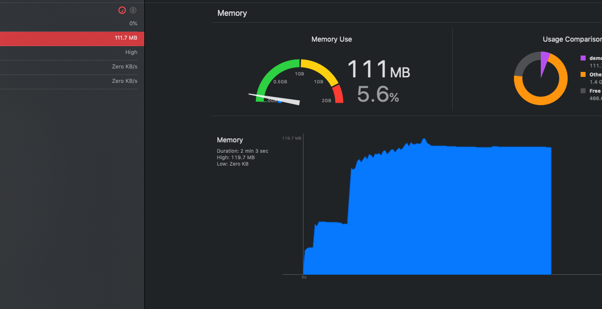
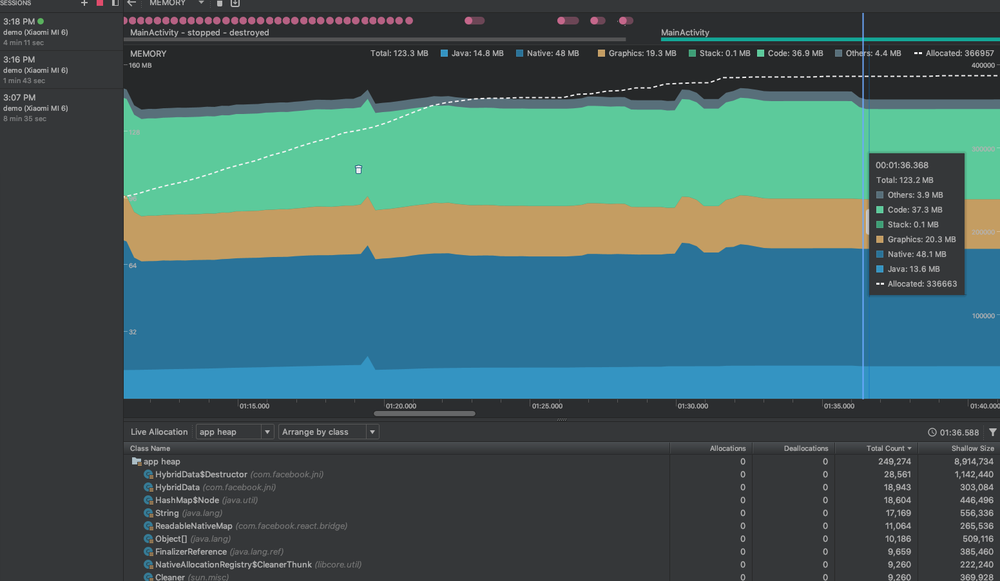

# react-native-nlist

react-nativ listView   Performance solution   Native implementation   Smooth memory recovery    Pull up refresh drop-down loading   Support native custom refreshing animation    Support itemView dynamic height

Performance is better than all current list components.   

### IOS  Use TabView   implementation 

Be based on  [react-native-tableview](https://github.com/aksonov/react-native-tableview) 
### Android  Use Recyclerview   implementation 
Recycling using duplicate templates


### Performance  testing

####ios  use iphone 6s     10015 data, lots of pictures.    No use of  [SDWebImage](https://github.com/SDWebImage/SDWebImage) to optimize images.
Fast slide to 4679th data   Memory usage 111 MB


		
#### Android  use MI 6   10015 data, lots of pictures.    No use of  [Glide](https://github.com/bumptech/glide) to optimize images.
Fast slide to 2569th data      Android's list scroll speed has a maximum threshold. I plan for 2 minutes.     Hand pain   ~~(╯﹏╰)     Memory usage 123 MB   
	
	


## installation
`$ npm install react-native-nlist --save`

## configuration

#### iOS

1. In XCode, in the project navigator, right click `your project name ` ➜ `Add Files to `
2. Go to `node_modules` ➜ `react-native-nlist` and add `/node_modules/react-native-nlist/ios/RNNlistcode`
3. Add  MJRefresh  use cocoapods     Create podfile under your IOS project  `/ios/Podfile`

```
 # Uncomment the next line to define a global platform for your project
platform :ios, '8.0'
target 'demo' do
  # Uncomment the next line if you're using Swift or would like to use dynamic frameworks
  # use_frameworks!
  # Pods for Driver
  use_frameworks!
  pod 'MJRefresh'
end

post_install do |installer|
  installer.pods_project.targets.each do |target|
    target.build_configurations.each do |config|
      config.build_settings['SWIFT_VERSION'] = '4.0'
    end
  end
end
```
` pod 'MJRefresh'`
 Execute a command  `pod install`
4. Run your project   `.xcworkspace`    (`Cmd+R`)<

#### Android

1. Open up `android/app/src/main/java/[...]/MainActivity.java`
  - Add `import com.janiokq.Nlist.RNNlistPackage;` to the imports at the top of the file
  - Add `new RNNlistPackage()` to the list returned by the `getPackages()` method
2. Append the following lines to `android/settings.gradle`:
  	```
  	include ':react-native-nlist'
  	project(':react-native-nlist').projectDir = new File(rootProject.projectDir, 	'../node_modules/react-native-nlist/android')
  	```
3. Insert the following lines inside the dependencies block in `android/app/build.gradle`:
  	```
      compile project(':react-native-nlist')
  	```
  	
## Attribute description


### onScroll   
 ios is  Height of content
 android is   The last rolling start difference       The negative number is upward.      The positive number is downward. 


### onScrollto  
  only  android     o and 1     value 
   1  Scroll to the head
   0  Scroll to the bottom


### reactModuleForCell  	
	ios  Template name     AppRegistry.registerComponent   generate
	  
	AppRegistry.registerComponent('Itemlist', () => Itemlist);


### renderItem  	
	android  Template name     A class name or function name.   


### springback 
  android  specific   scroll rebound effect similar to IOS

  
### canRefresh
  Whether to use drop-down refresh


### canLoadmore
 Whether to use pull-up refresh

 
### refreshState 
  Refresh state control


### loadinState
  Load state control


### onRefresh
  Refresh event  


### onLoadmore
  Load event


### dataSource
  data source  Array<Object>      Object  You must have the height attribute.
	
## Usage

list Use

```javascript
import RNNlist from 'react-native-nlist';

// TODO: What to do with the module?
RNNlist;

 <RNNlist
        onScroll={(e)=>{
          //ios is  Height of content
          //android is   The last rolling start difference       The negative number is upward.      The positive number is downward. 
          //direction
          // console.log(e.nativeEvent.contentOffset)


        }}
        // only  android
        onScrollto={(e)=>{
            // o and 1    
            // 1  Scroll to the head
            // 0  Scroll to the bottom
            //e
        }}
        inserttheway={0}
        //ios   Rendering template
        reactModuleForCell="Itemlist"
        //android  Rendering template
        renderItem={Itemlist}
        //Rendering initialization of Android
        Initializeprops={{}}

        //Android rolling rebound effect
        springback={true}
        //Android template quantity
        rowHeight={40}
        style={{
          width:width,
          height:height
        }}

        canRefresh={true}
        canLoadmore={true}

        refreshState={this.state.refreshState}
        loadinState={this.state.loadinState}
        dataSource={this.state.dataSource}

        onRefresh={()=>{
          setTimeout(()=>{
            this.getdata();
          },1000)
        }}
        onLoadmore={()=>{
          setTimeout(()=>{
            this.adddata();
          },1000)
        }}
    />
    

```

Template registration


```

class Itemlist extends  Component{
  constructor(props){
    super(props)
  }
  render() {
    let data  =  this.props;
    if(Platform.OS=='ios'){
        data =this.props.data;
    }

    return (
      <View style={{flex:1,}} >
            <View style={{
                width:width,
                height:data.height,
              }} >

              <Text>{data.index}</Text>

              <Image 
              // source={{
              //   uri:'http://img3.imgtn.bdimg.com/it/u=3360690558,3623061169&fm=11&gp=0.jpg'
              // }}
              source={{uri: 'https://ss3.bdstatic.com/70cFv8Sh_Q1YnxGkpoWK1HF6hhy/it/u=3360690558,3623061169&fm=111&gp=0.jpg'}}
              style={{
                width:width,
                height:data.height-30,
              }}
              resizeMode='stretch'
              />

              </View>
      </View>
    )
  }
}

AppRegistry.registerComponent('Itemlist', () => Itemlist);


```
  